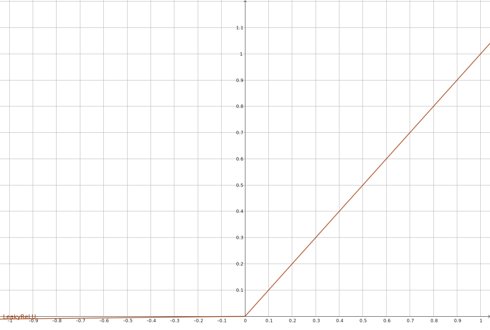

# 1. 激活函数 (Activation)

### Sigmoid

$$
 \sigma(x)=\frac{1}{1+e^{-x}}
$$
 **说明**：输出在 $(0,1)$；适合二分类输出（配合 BCE），但隐藏层容易发生梯度消失。
 **导数**：
$$
\sigma'(x)=\sigma(x)(1-\sigma(x))
$$

------

### Tanh

$$
 \tanh(x)=\frac{e^x-e^{-x}}{e^x+e^{-x}}
$$
 **说明**：输出在 $(-1,1)$，比 sigmoid 居中（均值为 0）常用于 RNN/隐藏层。仍有梯度消失问题。
 **导数**：
$$
 \frac{d}{dx}\tanh(x)=1-\tanh^2(x)
$$

------

### ReLU（Rectified Linear Unit）

$$
 \mathrm{ReLU}(x)=\max(0,x)
$$
 **说明**：计算简单，稀疏激活，缓解梯度消失。但负区间梯度为 0，可能出现“死神经元”。

 

------

### Leaky ReLU

$$
\mathrm{LeakyReLU}(x)=
\begin{cases}
 x,& x\ge 0\\
 \alpha x,& x<0
\end{cases}
$$
 通常 $\alpha=0.01$。**说明**：负区间保有小梯度，缓解 ReLU 死区问题。

------

### PReLU（Parametric ReLU）

$$
\mathrm{PReLU}(x)=\begin{cases}
 x,& x\ge 0\\
 a x,& x<0
 \end{cases}
$$
 其中 $a$ 为可学习参数。**说明**：比 Leaky 更灵活，但会增加参数。

------

### ELU（Exponential Linear Unit）

$$
\mathrm{ELU}(x)=\begin{cases}
 x,& x\ge0\\
 \alpha (e^x-1),& x<0
 \end{cases}
$$
 **说明**：负区间趋近于 $-\alpha$，能加速学习并部分居中激活。

------

### SELU（Scaled ELU）

$$
\mathrm{SELU}(x)=\lambda\begin{cases}
 x,& x>0\\
 \alpha(e^x-1),& x\le0
 \end{cases}
$$
 配套特殊初始化和网络结构可实现“自归一化”。

------

### GELU（Gaussian Error Linear Unit）

常用近似形式：
$$
 \mathrm{GELU}(x)=x\cdot \Phi(x) \quad(\Phi \text{ 为标准正态 CDF})
$$
 近似实现用：
$$
\mathrm{GELU}(x)\approx \tfrac{x}{2}\left(1+\tanh\left[\sqrt{\tfrac{2}{\pi}}\left(x+0.044715x^3\right)\right]\right)
$$
 **说明**：Transformer（BERT、GPT 系列）常用，表现优于 ReLU 的平滑替代。

------

### Swish

$$
 \mathrm{Swish}(x)=x\cdot\sigma(x)
$$
 **说明**：平滑，有时比 ReLU/GELU 更好，特别在大模型里表现不错。

------

### Mish

$$
 \mathrm{Mish}(x)=x\tanh(\ln(1+e^x))
$$
 **说明**：平滑、无界正区间，部分任务比 Swish/ELU 更优（但计算稍贵）。

------

### Softplus（平滑 ReLU）

$$
 \mathrm{Softplus}(x)=\ln(1+e^x)
$$
 **说明**：可微分的 ReLU 近似；导数为 sigmoid。

------

### Softmax（多类输出）

对于向量 $z\in\mathbb{R}^K$：
$$
\mathrm{Softmax}(z)_{i}=\frac{e^{z_i}}{\sum_{j=1}^{K} e^{z_j}}
$$
 **说明**：把 logits 转为概率分布。数值稳定实现用 $z-\max_j z_j$（避免 exp 溢出）。
 **常用变体**：Log-Softmax（用于 NLLLoss 的稳定实现）。

------

# 2. 损失函数 (Loss)

### MSE（Mean Squared Error）

$$
L_{\mathrm{MSE}}=\frac{1}{n}\sum_{i=1}^n (y_i-\hat y_i)^2
$$
 **说明**：回归常用；对离群点敏感（平方放大误差）。

------

### MAE（Mean Absolute Error）

$$
 L_{\mathrm{MAE}}=\frac{1}{n}\sum_{i=1}^n |y_i-\hat y_i|
$$
 **说明**：对离群点更稳健，但导数在 0 点不可导（可用 subgradient）。

------

### Huber Loss

$$
L_\delta(a)=
 \begin{cases}
 \frac{1}{2}a^2,& |a|\le\delta\\
 \delta(|a|-\tfrac{1}{2}\delta),& |a|>\delta
 \end{cases},\quad a=y-\hat y
$$
 **说明**：MSE 与 MAE 的折中，常用于含异常点的回归。

------

### Cross-Entropy（多类）

如果 $y$ 为 one-hot，$\hat p$ 为概率分布：
$$
 L=-\sum_{i} y_i \log \hat p_i
$$
 **说明**：分类任务最常用；通常与 softmax 一起使用。实现上常用 `log-softmax` + `nll` 以提高稳定性。

------

### Binary Cross-Entropy / BCEWithLogits

对二分类，若用 logits $z$：
$$
 \mathrm{BCEWithLogits}(z,y) = -\big[y\log \sigma(z) + (1-y)\log(1-\sigma(z))\big]
$$
 **实现提醒**：用 `BCEWithLogits`（直接用 logits 而不是先 sigmoid）避免数值不稳定。

------

### KL Divergence（Kullback–Leibler）

连续形式或离散形式，例如离散分布 $P,Q$：
$$
 D_{KL}(P|Q)=\sum_i P(i)\log\frac{P(i)}{Q(i)}
$$
 **说明**：VAE、知识蒸馏中常见（作为正则/约束）。非对称。

------

### NLL（Negative Log Likelihood）

分类时给定目标类别 $y$ 与 log-prob $\log p(y)$：
$$
 L_{\mathrm{NLL}}=-\log p(y)
$$
 常与 LogSoftmax 联用。

------

### Hinge Loss（SVM）

$$
 L_{\mathrm{hinge}}=\max(0, 1-y\cdot f(x))
$$
 **说明**：二分类与 margin 的损失，常用于传统 SVM。

------

### Focal Loss（处理类别不平衡）

$$
 L_{\mathrm{focal}}=- (1-p_t)^\gamma \log(p_t)
$$
 其中 $p_t$ 是预测概率，$\gamma>0$ 控制对困难样本的聚焦。常用于目标检测（如 RetinaNet）。

------

### Contrastive / Triplet / InfoNCE（表示学习）

- **Triplet Loss**（三元组）：
   $$
   L=\max\big(0,\; d(a,p)-d(a,n)+\alpha\big)
   $$
   其中 $a$ 为 anchor，$p$ positive，$n$ negative，$d(\cdot,\cdot)$ 距离，$\alpha$ margin。
- **InfoNCE（对比学习常见）**（简化）：
   $$
   L=-\log\frac{\exp(\mathrm{sim}(z,z^+)/\tau)}{\sum_{i}\exp(\mathrm{sim}(z,z_i)/\tau)}
   $$
   $\mathrm{sim}$ 常为余弦相似度，$\tau$ 温度参数。

------

### CTC Loss（连接时序分类）

用于对齐未知对齐标签（如语音识别）：数学形式复杂，通常使用动态规划实现（不可直接给出单行公式）。常用框架 API（如 `ctc_loss`）。

------

# 3. 正则化 / 其它防过拟合手段 (Regularization)

### L2 正则化（权重衰减）

$$
 \Omega_{L2}(w)=\lambda \sum_i w_i^2
$$
 **说明**：促使参数变小，常与优化器一起实现（注意：PyTorch 的 `weight_decay` 与直接在 loss 加 L2 有细微实现差异）。

------

### L1 正则化

$$
 \Omega_{L1}(w)=\lambda \sum_i |w_i|
$$
 **说明**：倾向稀疏权重（特征选择效果）。

------

### Dropout

训练时对每个神经元使用 Bernoulli 随机掩码：
$$
 \tilde h_i = \frac{h_i \cdot r_i}{1-p},\quad r_i\sim\mathrm{Bernoulli}(1-p)
$$
 **说明**：训练时随机丢弃，推理时按比例缩放或使用训练时的 scale。如上式为 inverted dropout（常用实现），训练-推理一致性更好。

------

### Label Smoothing

将 one-hot 软化：
$$
y^{LS}_k=(1-\epsilon)\cdot \mathbf{1}_{k=y} + \frac{\epsilon}{K}
$$
 **说明**：防止模型过度自信，常用于分类（Transformer 中常用）。

------

### Spectral Normalization

对层权重做谱范数规范化（常用于 GAN 的判别器），控制 Lipschitz 常数，提升稳定性。

------

# 4. 归一化 / 标准化 函数 (Normalization)

### Batch Normalization（BatchNorm）

对 mini-batch 的每个特征维度 $k$：
$$
 \hat x_k=\frac{x_k-\mu_k}{\sqrt{\sigma_k^2+\epsilon}},\quad y_k=\gamma_k \hat x_k + \beta_k
$$
 其中 $\mu_k,\sigma_k^2$ 为 batch 均值与方差，$\gamma,\beta$ 可学习。**说明**：加速训练，允许较大学习率；小 batch 时效果变差。

------

### Layer Normalization（LayerNorm）

对单个样本的特征维度归一：
$$
 \hat x=\frac{x-\mu_{\text{layer}}}{\sqrt{\sigma_{\text{layer}}^2+\epsilon}},\quad y=\gamma\hat x+\beta
$$
 **说明**：对 RNN 和 Transformer 更稳定（与 batch size 无关）。

------

### InstanceNorm / GroupNorm

- **InstanceNorm**：对每个样本每个通道独立归一（常用于风格迁移）。
- **GroupNorm**：把通道分组后做归一，适合小 batch。

------

### Weight Normalization / RMSNorm

- **WeightNorm**：对权重向量做 reparam，提高训练稳定性。
- **RMSNorm**：只用 RMS 信息做归一（无需均值），计算更简单。

------

# 5. 初始化（权重初始分布）

### Xavier / Glorot 初始化（均匀或正态）

针对激活函数对称（tanh）：
 方差设定（正态）：
$$
 \mathrm{Var}(w)=\frac{2}{n_\text{in}+n_\text{out}}
$$
 **说明**：保持前向/反向传播方差平稳。

------

### He / Kaiming 初始化

针对 ReLU：
$$
 \mathrm{Var}(w)=\frac{2}{n_\text{in}}
$$
 **说明**：ReLU 系列常用。

------

### Orthogonal 初始化

令权重矩阵为正交矩阵（适用于 RNN、深层网络时稳定训练）。

------

# 6. 相似度 / 距离 函数 (Similarity / Distance)

### 点积（Dot product）

$$
 \mathrm{dot}(x,y)=x^\top y
$$
 用于注意力、向量相似度基础。

------

### 余弦相似度（Cosine）

$$
 \mathrm{cosine}(x,y)=\frac{x^\top y}{|x||y|}
$$
 **说明**：对向量长度不敏感，仅看角度方向。常用于检索/相似度评估。

------

### 欧氏距离（L2）

$$
 d(x,y)=|x-y|_2=\sqrt{\sum_i (x_i-y_i)^2}
$$

------

### 曼哈顿距离（L1）

$$
 d(x,y)=|x-y|_1=\sum_i |x_i-y_i|
$$

------

### Mahalanobis 距离

$$
 d_M(x,y)=\sqrt{(x-y)^\top S^{-1}(x-y)}
$$
 其中 $S$ 为协方差矩阵。

------

# 7. 注意力与位置编码 (Attention & PosEnc)

### Scaled Dot-Product Attention

给 query $Q$、key $K$、value $V$：
$$
\mathrm{Attention}(Q,K,V)=\mathrm{softmax}\left(\frac{QK^\top}{\sqrt{d_k}}\right)V
$$
 **说明**：$\sqrt{d_k}$ 用于缩放以缓解点积随维度增长而变大导致 softmax 梯度消失的问题。

------

### Multi-Head Attention（概念公式）

$$
\mathrm{MultiHead}(Q,K,V)=\mathrm{Concat}(\text{head}_1,\dots,\text{head}_h)W^O
$$
$$
\text{head}_i=\mathrm{Attention}(QW_i^Q, KW_i^K, VW_i^V)
$$

------

### Sinusoidal Positional Encoding（Transformer 原始）

对位置 $pos$ 和维度 $i$：
$$
\begin{aligned}
 PE_{(pos,2i)} &= \sin\left(\frac{pos}{10000^{2i/d}}\right)\\
 PE_{(pos,2i+1)} &= \cos\left(\frac{pos}{10000^{2i/d}}\right)
 \end{aligned}
$$
 **说明**：为序列模型提供位置信息；也可用可学习的位置编码。

------

# 8. 优化器相关（优化器更新公式与学习率调度）

### SGD（带或不带 momentum）

- **SGD**：
   $$
   w_{t+1}=w_t - \eta \nabla_w L(w_t)
   $$
- **Momentum**：
   $$
   v_{t+1}=\mu v_t + \eta \nabla_w L(w_t),\quad w_{t+1}=w_t - v_{t+1}
   $$
   其中 $\mu$ 是 momentum（惯性系数）。

------

### Adam（自适应一阶优化器）

参数：$\beta_1,\beta_2,\epsilon$
$$
\begin{aligned}
 m_t&=\beta_1 m_{t-1} + (1-\beta_1) g_t\\
 v_t&=\beta_2 v_{t-1} + (1-\beta_2) g_t^2\\
 \hat m_t&=\frac{m_t}{1-\beta_1^t},\quad \hat v_t=\frac{v_t}{1-\beta_2^t}\\
 w_{t+1}&=w_t - \eta \frac{\hat m_t}{\sqrt{\hat v_t}+\epsilon}
 \end{aligned}
$$
 **说明**：广泛用于 Transformer / 大模型训练。注意学习率与 weight decay 的配合（AdamW 推荐分离 weight decay）。

------

### RMSProp / Adagrad

- **Adagrad**：历史梯度平方和累计，适合稀疏梯度。
- **RMSProp**：对平方梯度做指数平均，避免 Adagrad 的学习率过快衰减。

------

### 学习率调度（常见）

- **Step decay**：每 $k$ 步降低 lr（乘以 gamma）。
- **Exponential decay**：$\eta_t=\eta_0 e^{-kt}$.
- **Cosine annealing**（无/有热重启）：常见于训练后期退火。
- **Warmup**：训练初期线性/指数升高 lr（Transformer 常用线性 warmup + 后续衰减）。
   **说明**：大模型常用 `linear warmup` + `Adam` + `cosine decay` 或 `inverse sqrt` 衰减。

------

# 9. 其它常见数学工具（数值稳定性等）

### LogSumExp（数值稳定的 log-sum-exp）

$$
 \log\sum_i e^{x_i} = m + \log\sum_i e^{x_i-m},\quad m=\max_i x_i
$$
 **说明**：用于 stable softmax / log-likelihood 计算，避免溢出。

------

### Softmax with Temperature

$$
\mathrm{softmax}_\tau(z)_i=\frac{e^{z_i/\tau}}{\sum_j e^{z_j/\tau}}
$$
 $\tau<1$ 使分布更尖锐，$\tau>1$ 更平滑。常用于知识蒸馏或采样控制。

------

### Gradient Clipping（梯度裁剪）

- **按值裁剪**：$g_i=\mathrm{clip}(g_i,-c,c)$
- **按范数裁剪**：若 $|g|_2>c$，则 $g\leftarrow g\cdot \frac{c}{|g|_2}$
   **说明**：RNN / 大学习率下防止梯度爆炸。

------

# 小结

- 激活函数：Transformer/大模型 通常选 **GELU** 或 **Swish**；传统 CNN 常用 **ReLU/LeakyReLU**。
- 损失函数：分类用 **Cross-Entropy/NLL**；回归用 **MSE/Huber**；不平衡用 **Focal**。
- 归一化：Transformer 用 **LayerNorm**；CNN 多用 **BatchNorm**（但小 batch 时考虑 GroupNorm）。
- 优化器：大模型通常用 **Adam / AdamW** + **线性 Warmup + Cosine Decay**。注意 weight decay 的实现方式（AdamW 与旧 Adam + L2 不同）。
- 数值稳定性：softmax/log-sum-exp、BCEWithLogits、log-softmax 等稳定实现非常重要。
- 调参实践：学习率、batch size、权重衰减、warmup 步数对大模型影响最大。

