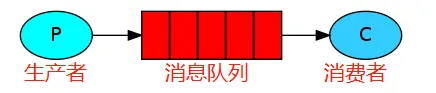

### MQ（消息队列）

消息指的是两个应用间传递的数据。数据的类型有很多种形式，可能只包含文本字符串，也可能包含嵌入对象。

“消息队列(Message Queue)”是在消息的传输过程中保存消息的容器。在消息队列中，通常有生产者和消费者两个角色。生产者只负责发送数据到消息队列，谁从消息队列中取出数据处理，他不管。消费者只负责从消息队列中取出数据处理，他不管这是谁发送的数据。

### 消息队列作用

1. **解耦。**将系统间/组件间的通信集中到消息队列，谁需要数据谁就到消息队列里取用
2. **异步。**利用消息队列作为数据中转站，从而可以在提交数据后就响应客户端，实现异步处理
3. **削峰。**将短时间内大量请求积压在消息队列中，后面由消费者慢慢进行处理，达到削峰的目的

### RabbitMQ概念

- Broker：消息队列服务进程，包含Exchange和Queue
- Exchange：消息队列交换机，按一定的路由规则将消息传递给Queue
- Queue：存储消息的队列
- Producer：生产者
- Consumer：消费者
- Connection：生产者或消费者与Broker的连接，包含多个Channel
- Channel：连接内的虚拟连接，一切发布消息或使用消息都是通过它完成

### 交换机类型

1. Direct

   直连交换机会将消息发送到**绑定键**与消息的**路由键**完全匹配的队列

2. Fanout

   该交换机会将消息发送到与之绑定的**所有**队列

3. Topic

   该交换机可以配置通配符规则，`*`匹配单个词`#`匹配多个词，路由键由`.`分隔，两个`.`之间记作一个词

4. Headers

   不使用路由键进行匹配，使用**请求头**中的信息进行匹配

5. *X-Delayed-Message*

   使用RabbitMQ插件添加的交换机，用于延迟收信

