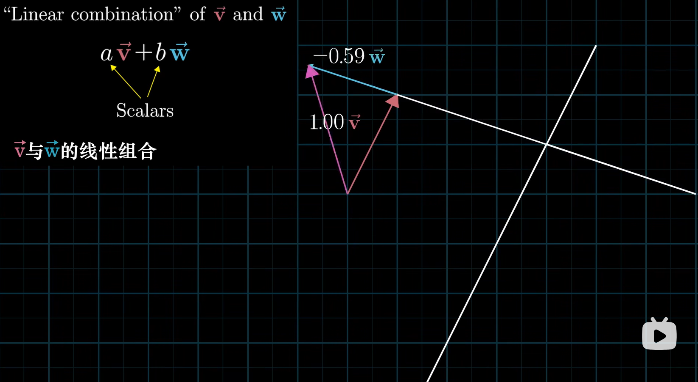

## 向量

向量是一个抽象的数学概念，只要满足**一个向量经过数值放缩之后仍是一个唯一向量**和**两个向量经过向量加法可以得到一个唯一向量**那么就可以视作向量，如此，所有的线性变换对这个定义下的向量都适用，这在建模的时候会很有用，比如将函数视为向量

也就是说只要定义好**向量的形式，向量的数乘方法和向量加法**就可以对其使用线性代数的工具，需要注意的是，定义的方法需要使下面等式成立
$$
\vec{v}+\vec{v}=2\vec{v}
$$

## 向量空间

向量空间是通过选择的**基底向量**进行**线性组合**张成的空间，有几个**线性无关**的基底向量这个空间就有多少个维度，需要注意的是当使用**坐标**表示向量时，有几个坐标维度这个空间就有几个维度

## 矩阵

矩阵有几个视角

1. 矩阵是一个向量空间

   把矩阵看作是向量列表，那么矩阵就是以这些向量为基底向量张成的向量空间，矩阵的秩就是向量空间的维度
   $$
   \mathbf{W}=[\vec{v_{1}},\;\vec{v_{2}}...]
   $$

2. 矩阵是一个线性变换

   把矩阵看作是一个关于**向量**的**变换**，其内容是同在某个空间的向量的**采样**集合，其输入是**维度**大小与矩阵中**向量数量**相等的**空间**中的**向量**，输出是输入向量在矩阵所在的向量空间中的**投影**，变换内容可以理解为将输入空间的**单位正交基底**变换成矩阵中对应的向量的**空间变换**

   如：
   $$
   \begin{bmatrix}
   1 & 1 \\
   0 & 0 \\
   0 & 0
   \end{bmatrix}
   \cdot
   \begin{bmatrix}
   1 & 3 \\
   2 & 4
   \end{bmatrix}
   =
   \begin{bmatrix}
   3 & 7 \\
   0 & 0 \\
   0 & 0
   \end{bmatrix}
   $$
   在这个式子中我们将最左边的矩阵视为一个变换，这个矩阵由3维空间中采样的2个向量组成，输入是2维空间中的2个向量，输出是这2个向量在矩阵所在的3维空间的投影，实际上这个变换的意思就是将一个2维空间压缩映射到3维空间中的一个轴上

## 矩阵乘法与复合矩阵

以矩阵是一个变换的角度去看矩阵乘法
$$
\mathbf{A}\mathbf{B}\vec{v}=\mathbf{C}\vec{v}
$$
如果上式成立，那么意味着对向量进行C变换，应该与先进行B变换再进行A变换的结果一致，则称矩阵C是矩阵A、B的复合矩阵，类似于复合函数
$$
f(g(x))=f\cdot g(x)
$$
所以矩阵乘法可以看作是复合矩阵变换的做法，要注意乘法的**顺序**

## 行列式

矩阵（仅限方阵）的行列式$det(A)$表示的是矩阵所代表的变换，对原空间的缩放**比例**，符号代表空间的**取向**与原空间是否相同，利用行列式的绝对值能够快速计算变换后的测度（如面积、体积等）

