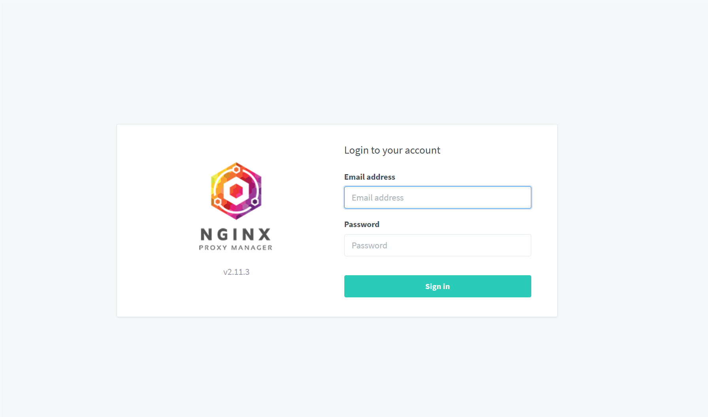
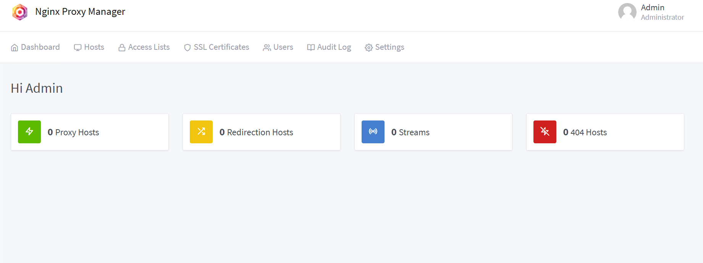
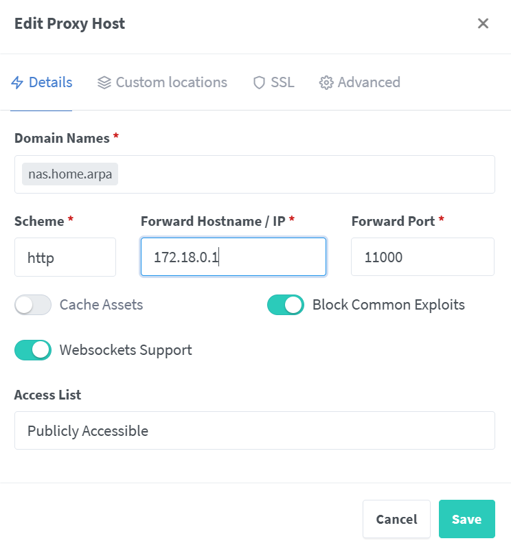
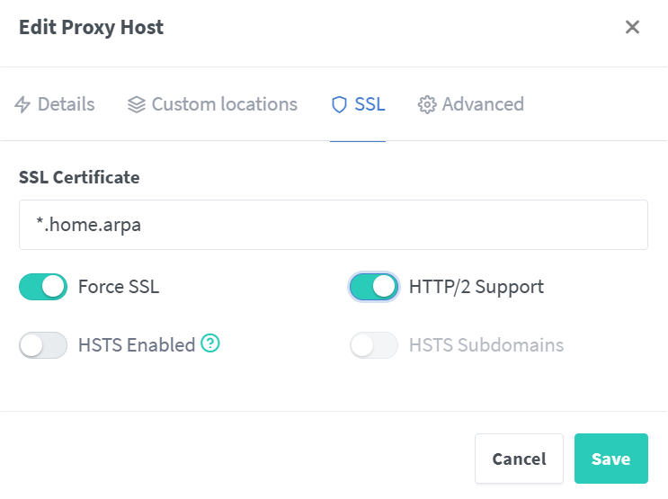

## 安装Docker

1. 清理旧版本

   ```bash
   for pkg in docker.io docker-doc docker-compose docker-compose-v2 podman-docker containerd runc; do sudo apt-get remove $pkg; done
   ```

2. 添加Docker的apt仓库

   ```bash
   # Add Docker's official GPG key:
   sudo apt-get update
   sudo apt-get install ca-certificates curl
   sudo install -m 0755 -d /etc/apt/keyrings
   sudo curl -fsSL https://download.docker.com/linux/ubuntu/gpg -o /etc/apt/keyrings/docker.asc
   sudo chmod a+r /etc/apt/keyrings/docker.asc
   
   # Add the repository to Apt sources:
   echo \
     "deb [arch=$(dpkg --print-architecture) signed-by=/etc/apt/keyrings/docker.asc] https://download.docker.com/linux/ubuntu \
     $(. /etc/os-release && echo "$VERSION_CODENAME") stable" | \
     sudo tee /etc/apt/sources.list.d/docker.list > /dev/null
   sudo apt-get update
   ```

3. 安装Docker

   ```bash
   sudo apt-get install docker-ce docker-ce-cli containerd.io docker-buildx-plugin docker-compose-plugin
   ```

4. 开机自启动

   ```bash
   sudo systemctl enable docker
   ```

5. 编辑~/.docker/config.json添加代理，会被加入容器

   ```json
   {
   	"proxies": {
           "default": {
               "httpProxy": "http://dockerIP:vpnPort",
               "httpsProxy": "http://dockerIP:vpnPort",
               "noPorxy": "localhost,127.0.0.1,zeronsd域名"
           }
       }
   }
   ```

## 安装ZeroTier

### Web端

1. 注册ZeroTier账号、登录
2. 创建一个网络
3. 创建账户的API Access Token
4. 等待客户端接入
5. 对接入的客户端进行授权和命名

### NAS

1. 拉取或从Dockerfile构建ZeroTier镜像

   ```bash
   sudo docker pull zerotier/zerotier
   ```

2. 运行容器

   ```bash
   sudo docker run -d \
                            --name zerotier \
                            --device=/dev/net/tun \
                            --net=host \
                            --cap-add=NET_ADMIN \
                            --cap-add=SYS_ADMIN \
                            --restart=always \
                            -v ~/zerotier-one/:/var/lib/zerotier-one/ \
                            zerotier/zerotier:latest
   ```
   
3. 进入容器，加入网络，开启DNS

   ```bash
   sudo docker exec -it zerotier /bin/bash
   # 容器内
   zerotier-cli join networkID
   zerotier-cli set networkID allowDNS=1
   ```

4. 拉取或者构建ZeroNSD镜像，用来搭建ZeroTier的DNS

   ```bash
   sudo docker pull zerotier/zeronsd
   ```

5. 运行容器

   ```bash
   sudo docker run -d \
                            --net=host \
                            -v ~/zerotier-one/authtoken.secret:/authtoken.secret \
                            --restart=always \
                            -e ZEROTIER_CENTRAL_TOKEN=<token> \
                            --name zeronsd \
                            zerotier/zeronsd:latest start -s /authtoken.secret \
                            <networkID>
   ```

### 云服务器

1. 安装ZeroTier

   ```bash
   curl -s https://install.zerotier.com | sudo bash
   ```

2. 加入网络，开启DNS

   ```bash
   zerotier-cli join networkID
   zerotier-cli set networkID allowDNS=1
   ```

3. 进入ZeroTier配置文件夹，配置Moon服务器

   ```bash
   cd /var/lib/zerotier-one
   zerotier-idtool initmoon identity.public >> moon.json
   ```

4. 查看moon配置，并在roots.stableEndpoints填入"IP/端口"，可以使用公网IP，端口默认9993

   ```json
       {
         "id": "deadbeef00",
         "objtype": "world",
         "roots": [
           {
             "identity": "deadbeef00:0:34031483094...",
             "stableEndpoints": ["IP/PORT"]
           }
         ],
         "signingKey": "b324d84cec708d1b51d5ac03e75afba501a12e2124705ec34a614bf8f9b2c800f44d9824ad3ab2e3da1ac52ecb39ac052ce3f54e58d8944b52632eb6d671d0e0",
         "signingKey_SECRET": "ffc5dd0b2baf1c9b220d1c9cb39633f9e2151cf350a6d0e67c913f8952bafaf3671d2226388e1406e7670dc645851bf7d3643da701fd4599fedb9914c3918db3",
         "updatesMustBeSignedBy": "b324d84cec708d1b51d5ac03e75afba501a12e2124705ec34a614bf8f9b2c800f44d9824ad3ab2e3da1ac52ecb39ac052ce3f54e58d8944b52632eb6d671d0e0",
         "worldType": "moon"
       }
   ```

5. 生成moon，重启服务

   ```bash
   zerotier-idtool genmoon moon.json
   mkdir moons.d
   mv 0000worldID.moon moons.d/0000worldID.moon
   /etc/init.d/zerotier-one restart
   ```

6. 其他客户端订阅moon服务器

   ```bash
   zerotier-cli orbit worldID rootID
   ```

## 安装Nignx Proxy Manager

1. 拉取镜像

   ```bash
   sudo docker pull jc21/nginx-proxy-manager
   ```

2. 运行容器

   ```bash
   sudo docker run -d \
                            --restart=always \
                            -p 80:80 -p 443:443 -p 81:81 \
                            -v ~/nignx-proxy-manager/data:/data -v ~/nignx-proxy-manager/letsencrypt:/etc/letsencrypt \
                            --name nignx-proxy-manager \
                            jc21/nginx-proxy-manager:latest
   ```

## 安装硬盘

1. 将两块机械硬盘插入机箱

2. 查看硬盘

   ```bash
   sudo fdisk -l
   ```

   ```
   Disk /dev/nvme0n1：238.47 GiB，256060514304 字节，500118192 个扇区
   Disk model: aigo NVMe SSD P3500 256GB 
   单元：扇区 / 1 * 512 = 512 字节
   扇区大小(逻辑/物理)：512 字节 / 512 字节
   I/O 大小(最小/最佳)：512 字节 / 512 字节
   磁盘标签类型：gpt
   磁盘标识符：89E7ED5D-5DDD-4A92-8808-CAC413B4C5EE
   
   设备              起点      末尾      扇区   大小 类型
   /dev/nvme0n1p1    2048   2203647   2201600     1G EFI 系统
   /dev/nvme0n1p2 2203648   6397951   4194304     2G Linux 文件系统
   /dev/nvme0n1p3 6397952 500115455 493717504 235.4G Linux 文件系统
   
   
   Disk /dev/mapper/ubuntu--vg-ubuntu--lv：235.42 GiB，252782313472 字节，493715456 个扇区
   单元：扇区 / 1 * 512 = 512 字节
   扇区大小(逻辑/物理)：512 字节 / 512 字节
   I/O 大小(最小/最佳)：512 字节 / 512 字节
   
   
   Disk /dev/sda：1.82 TiB，2000398934016 字节，3907029168 个扇区
   Disk model: ST2000VN004-2E41
   单元：扇区 / 1 * 512 = 512 字节
   扇区大小(逻辑/物理)：512 字节 / 4096 字节
   I/O 大小(最小/最佳)：4096 字节 / 4096 字节
   
   
   Disk /dev/sdb：1.82 TiB，2000398934016 字节，3907029168 个扇区
   Disk model: ST2000VN004-2E41
   单元：扇区 / 1 * 512 = 512 字节
   扇区大小(逻辑/物理)：512 字节 / 4096 字节
   I/O 大小(最小/最佳)：4096 字节 / 4096 字节
   ```

3. 对硬盘进行分区、更改分区类型、保存

   ```bash
   sudo fdisk /dev/sda # /dev/sdb同理
   命令(输入 m 获取帮助)： n
   # 后续使用默认选项即可
   
   # 分区完成后
   命令(输入 m 获取帮助)： t
   Hex code or alias (type L to list all): L
   Hex code or alias (type L to list all): 8E # 改成LVM
   
   # 写入磁盘保存
   命令(输入 m 获取帮助)： w
   ```

   ```bash
   sudo fdisk -l
   ```

   ```
   Disk /dev/sda：1.82 TiB，2000398934016 字节，3907029168 个扇区
   Disk model: ST2000VN004-2E41
   单元：扇区 / 1 * 512 = 512 字节
   扇区大小(逻辑/物理)：512 字节 / 4096 字节
   I/O 大小(最小/最佳)：4096 字节 / 4096 字节
   磁盘标签类型：dos
   磁盘标识符：0x18312fd8
   
   设备       启动  起点       末尾       扇区  大小 Id 类型
   /dev/sda1        2048 3907029167 3907027120  1.8T 8e Linux LVM
   
   
   Disk /dev/sdb：1.82 TiB，2000398934016 字节，3907029168 个扇区
   Disk model: ST2000VN004-2E41
   单元：扇区 / 1 * 512 = 512 字节
   扇区大小(逻辑/物理)：512 字节 / 4096 字节
   I/O 大小(最小/最佳)：4096 字节 / 4096 字节
   磁盘标签类型：dos
   磁盘标识符：0xbbb3186f
   
   设备       启动  起点       末尾       扇区  大小 Id 类型
   /dev/sdb1        2048 3907029167 3907027120  1.8T 8e Linux LVM
   ```

4. 创建PV

   ```bash
   sudo pvcreate /dev/sda1 # 另一块同理
   ```

5. 创建VG

   ```bash
   sudo vgcreate nas-storage /dev/sda1 # 用一块PV创建VG，建一个就好
   sudo vgextend nas-storage /dev/sdb1 # 扩容VG
   ```

6. 创建LV

   ```bash
   sudo lvcreate -l 100%FREE --name nas-storage-lv nas-storage
   ```

7. 格式化LV

   ```bash
   sudo mkfs --type=ext4 /dev/nas-storage/nas-storage-lv
   ```

8. 挂载LV

   ```bash
   mkdir /mnt/ncdata
   sudo mount /dev/nas-storage/nas-storage-lv /mnt/ncdata
   ```

   ```bash
   sudo df -Th
   ```

   ```
   文件系统                                  类型   大小  已用  可用 已用% 挂载点
   tmpfs                                     tmpfs  3.1G  1.7M  3.1G    1% /run
   /dev/mapper/ubuntu--vg-ubuntu--lv         ext4   232G   14G  207G    7% /
   tmpfs                                     tmpfs   16G     0   16G    0% /dev/shm
   tmpfs                                     tmpfs  5.0M     0  5.0M    0% /run/lock
   /dev/nvme0n1p2                            ext4   2.0G  253M  1.6G   14% /boot
   /dev/nvme0n1p1                            vfat   1.1G  6.1M  1.1G    1% /boot/efi
   tmpfs                                     tmpfs  3.1G     0  3.1G    0% /run/user/1000
   /dev/mapper/nas--storage-nas--storage--lv ext4   3.6T   28K  3.4T    1% /mnt/ncdata
   ```

9. 配置开机自动挂载

   ```bash
   # 查看文件系统UUID
   sudo blkid
   
   sudo vim /etc/fstab
   
   # 添加一行
   UUID=8aba1ccb-750e-4d00-9566-a786537bee30 /mnt/ncdata ext4 defaults 0 0
   
   # 重新挂载（读取/etc/fstab）
   sudo mount -a
   sudo df -h
   ```

## 安装NextCloud AIO

1. 拉取镜像

   ```bash
   sudo docker pull nextcloud/all-in-one
   ```

2. 运行容器

   ```bash
   sudo docker run -d \
                            --init \
                            --sig-proxy=false \
                            --name nextcloud-aio-mastercontainer \
                            --restart always \
                            --publish 8080:8080 \
                            --env APACHE_PORT=11000 \
                            --env APACHE_IP_BINDING=0.0.0.0 \
                            --env NEXTCLOUD_DATADIR="data-dir" \
                            --add-host zeronsd域名:zerotierIP \
                            --env NEXTCLOUD_TRUSTED_CACERTS_DIR=ca-certificates-dir \
                            --volume /etc/ssl/certs:/etc/ssl/certs \
                            --volume nextcloud_aio_mastercontainer:/mnt/docker-aio-config \
                            --volume /var/run/docker.sock:/var/run/docker.sock:ro \
                            nextcloud/all-in-one:latest
   ```

## 获取证书

1. 安装mkcert

   ```bash
   sudo apt install libnss3-tools
   curl -JLO "https://dl.filippo.io/mkcert/latest?for=linux/amd64"
   chmod +x mkcert-v*-linux-amd64
   sudo mv mkcert-v*-linux-amd64 /usr/local/bin/mkcert
   ```

2. 生成本地CA证书

   ```bash
   mkcert -install
   ```

3. 生成服务器证书

   ```bash
   mkcert "*.home.arpa"
   ```

4. 容器信任证书，将主机/etc/ssl/certs映射到容器

## 进行配置

1. 访问Nignx Proxy Manager管理网站http://nas服务器ip:81，连接了ZeroTier可以使用ZeroTier内网ip

   默认用户名admin@example.com，密码changeme

2. 填写好基本信息后回到首页，选择Proxy Hosts->Add Proxy Host

   

   ```bash
   # 给nignx proxy manager添加nextcloud aio的网卡
   sudo docker network connect nextcloud-aio nignx-proxy-manager
   ```

   填写ZeroNSD生成的域名，ip填写网卡nextcloud-aio的ip，端口填写aio启动参数apache_port端口

   

3. 转到Advanced，填写下面配置，保存

   ```
   client_body_buffer_size 512k;
   proxy_read_timeout 86400s;
   client_max_body_size 0;
   ```

4. 转到SSL Certificates，添加mkcert生成的证书

5. 回到Proxy Hosts，编辑，选择SSL，选择已有证书

   

6. 访问https://nas服务器ip:8080到达NextCloud网站，默认密码在下方，记得**复制**

7. 填写nignx中配置的域名

8. 选择所需容器，等待安装完成