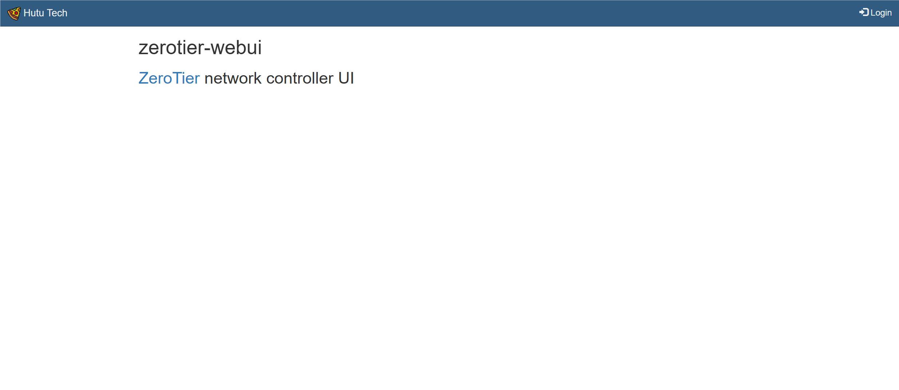
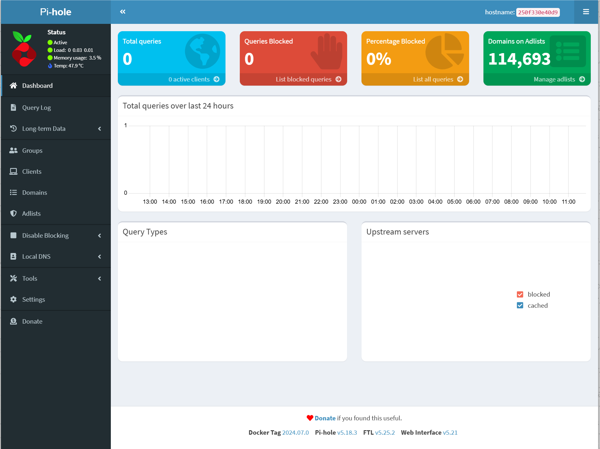

## 前言

之前捣鼓了很久，NAS基本运行起来了，但是还存在证书信任等问题，非常烦。问了GPT，提供了一个ZeroTier + Pi-Hole + Caddy的网络方案（不得不说，科技改变生活）

## 重置服务器

- ### 删除证书

  ```bash
  mkcert -uninstall
  
  cd /etc/ssl/certs
  rm xxxx.pem # 删除空的根证书软链接
  rm xxxx.0 # 删除空的根证书hash软链接
  
  rm -r ~/.local/share/mkcert
  ```

- ### 清理docker

  ```bash
  sudo docker stop xxx # 停止所有容器（除了dae）
  sudo docker container prune # 删除停止的容器
  sudo docker network rm nextcloud-aio # 删除虚拟网卡
  sudo docker volume prune --filter all=1 # 删除空挂载卷
  sudo docker image prune -a # 删除无活动镜像
  ```
  
- ### 清理文件

  ```bash
  sudo rm -r /mnt/ncdata/ftp
  sudo rm -r /mnt/ncdata/nextcloud
  
  sudo rm -r ~/xxxx # 清理home目录下相关文件
  ```


## 安装ZeroTier

- ### 介绍

  ZeroTier是P2P VPN，利用在互联网中构建一个虚拟局域网来实现组网。

  

  一般情况下ZeroTier使用UDP进行打洞（先利用共同的通信服务器交换两台设备的链路信息，然后两台设备利用信息实现直连），实现内网直连；UDP打洞失败情况下会使用TCP中继。
  
  ZeroTier除了官方实现外，还有很多第三方控制器，用以解除对设备数量的限制。这里我选择的是imashen/zerotier-aio，集成了ZeroTier 1.14.0、ztnui和planet构建工具
  
- ## 安装

- 拉取镜像

  ```bash
  sudo docker pull imashen/zerotier-aio
  ```

- 运行容器

  ```bash
  sudo docker run -d -p 9993:9993/udp -p 3443:3443 -p 3180:3180 \
      -v zerotier-one:/var/lib/zerotier-one \
      -v zerotier-webui:/www/zerotier-webui/etc \
      -v zerotier-logs:/logs \
      -e ZEROTIER-WEBUI_PASSWD=<password> \
      -e MYADDR=<outter-network-ip> \
      -e MYDOMAIN=site.home \
      --name zerotier-aio \
      --restart always \
      imashen/zerotier-aio
  # 9993是ZeroTier打洞端口，3443是面板https端口，3180是http服务器端口
  # 该容器需要有公网ip，作为整个局域网的控制器和根节点（可选）
  # 迁移只需复制三个卷
  ```

- 访问https://本机ip:3443

  

  默认用户名admin，密码为设置的密码，如果密码太弱会被自动更换，需要进入容器日志查看

  ```bash
  sudo docker exec -it zerotier-aio /bin/bash
  cd /logs
  cat zerotier-webui.log
  ```

  新建一个网络->easy setup，生成网络IP池

  进入IP池，创建一个/80的ipv6 IP池

  进入ipv6选项，勾选自动分配及6plane

  进入路由选项，填入ipv6子网，路由留空

- 在其他ZeroTier客户端，加入该网络，启用DNS，全局ip和默认路由

  ```bash
  zerotier-cli join <networkID>
  zerotier-cli set <networkID> allowDNS=1
  zerotier-cli set <networkID> allowGlobal=1
  zerotier-cli set <networkID> allowDefault=1
  ```

- ## 加速

- 进入zerotier-zio容器，配置planet

  ```bash
  sudo docker exec -it zerotier-aio /bin/bash
  mkplanet -b2j
  # 在roots中配置，配置项为{"identity": "zerotier-id", "stableEndpoints": [ipv4/zerotier-udp-or-tcp-port, ipv6/zerotier-udp-or-tcp-port]}，最多四个
  vim planet.json
  mkplanet -j2b
  ```

  将生成的planet文件替换客户端下planet文件，重启zerotier服务，可以将planet文件放在/www/zerotier-webui/etc/myfs/下供客户端下载

  > Linux：/var/lib/zerotier-one
  >
  > Windows：C:\ProgramData\ZeroTier\One
  >
  > MacOS：/Library/Application\ Support/ZeroTier/One

## 安装Pi-hole

- ## 安装

- 拉取镜像

  ```bash
  sudo docker pull pihole/pihole
  ```

- 停止系统默认域名解析服务

  ```bash
  sudo systemctl stop systemd-resolved
  vim /etc/systemd/resolved.conf # 解除注释DNSStubListener，并改为no
  sudo systemctl restart systemd-resolved
  # 用/run/systemd/resolve/resolv.conf替换软链接/run/systemd/resolve/stub-resolv.conf
  sudo ln -sf /run/systemd/resolve/resolv.conf /etc/resolv.conf
  ```

- 运行容器

  ```bash
  sudo docker run -d \
      --name pihole \
      --cap-add=NET_ADMIN \
      --restart always \
      -p 53:53/tcp -p 53:53/udp -p 8000:80/tcp \
      -e TZ=Asia/Shanghai -e WEBPASSWORD=<password> \
      -v etc-pihole:/etc/pihole -v etc-dnsmasq_d:/etc/dnsmasq.d \
      pihole/pihole
  # 80是面板入口，需要修改映射以防端口冲突
  ```

- 访问http://宿主机ip或zerotier虚拟ip:8000/admin，登录面板

  

  在Local DNS->DNS Records中添加自定义域名（节点名称**.**域名）及对应的zerotier虚拟ip4和ipv6（dae需要）

  在Settings->DNS->Interface settings中，选择Permit all origins

- 在ZeroTier自建控制器中设置网络的dns，域名填写和pihole中的一致，ip填写pihole所在节点的虚拟ip

- 在dae中配置代理自建DNS

  ```bash
  # 添加合并内容
  dns {
  	upstream {
  		piholedns: 'tcp+udp://zerotier虚拟ip:53'
  	}
  	routing {
  		request {
  			qname(suffix: 你的域名) -> piholedns
  		}
  		response {
  			upstream(piholedns) -> accept
  		}
  	}
  }
  routing {
  	sip(dns源填的ip) && l4proto(udp) && port(53) -> must_direct
  }
  ```

## 获取域名

- ### 免费域名

- 访问[getlocalcert](https://console.getlocalcert.net/)，使用GitHub登录注册

- 注册一个免费域名，记得选择**.localcert.net**，.localhostcert.net只能用于本机测试

- 生成API Key，保存json文件

- zerotier网络配置的域名需要与该域名一致，否则可能需要额外dns配置才能实现访问

## 安装Caddy

- ### 安装

- 拉取镜像

  ```bash
  sudo docker pull caddy:<version>-builder
  sudo docker pull caddy:<version>
  ```

- 构建DNS质询caddy镜像

  ```bash
  sudo vim Dockerfile
  
  # 内容
  # FROM caddy:<version>-builder AS builder
  #
  # RUN xcaddy build --with github.com/caddy-dns/acmedns
  #
  # FROM caddy:<version>
  #
  # COPY --from=builder /usr/bin/caddy /usr/bin/caddy
  
  sudo docker build -t caddy:<tag> .
  ```

- 运行容器

  ```bash
  sudo docker run -d \
      --restart always \
      --name caddy \
      -p 80:80 -p 443:443 -p 443:443/udp \
      -v caddy_data:/data \
      -v caddy_config:/config \
      -v /path/to/Caddyfile/Dir:/etc/caddy \
      caddy
  ```

- Caddyfile配置

  ```json
  <yourSubdomain>.localcert.net {
    tls {
      # ca https://acme-staging-v02.api.letsencrypt.org/directory
      dns acmedns <creds.json>
    }
    respond "Hello from Caddy"
  }
  ```

  可以先解除注释，尝试获取证书，确认无误后再使用正式环境获取证书

## 安装NextCloud AIO

- ### 安装

- 拉取镜像

  ```bash
  sudo docker pull nextcloud/all-in-one
  ```

- 配置反向代理

  ```json
  # Caddyfile
  https://<yourSubdomain>.localcert.net:443 {
    reverse_proxy nextcloud-aio网卡的ip:11000
  }
  ```

- 运行容器

  ```bash
  sudo docker run -d \
                           --init \
                           --sig-proxy=false \
                           --name nextcloud-aio-mastercontainer \
                           --restart always \
                           --publish 8080:8080 \
                           --env APACHE_PORT=11000 \
                           --env APACHE_IP_BINDING=0.0.0.0 \
                           --env NEXTCLOUD_DATADIR="data-dir" \
                           --volume nextcloud_aio_mastercontainer:/mnt/docker-aio-config \
                           --volume /var/run/docker.sock:/var/run/docker.sock:ro \
                           nextcloud/all-in-one:latest
  ```

- 给caddy添加nextcloud-aio网卡，dae代理nextcloud-aio网卡

## 安装ftp服务器

- ### 安装proftpd

- 操作同前[同前](组建NAS（三）.md/#安装ftp服务器)
