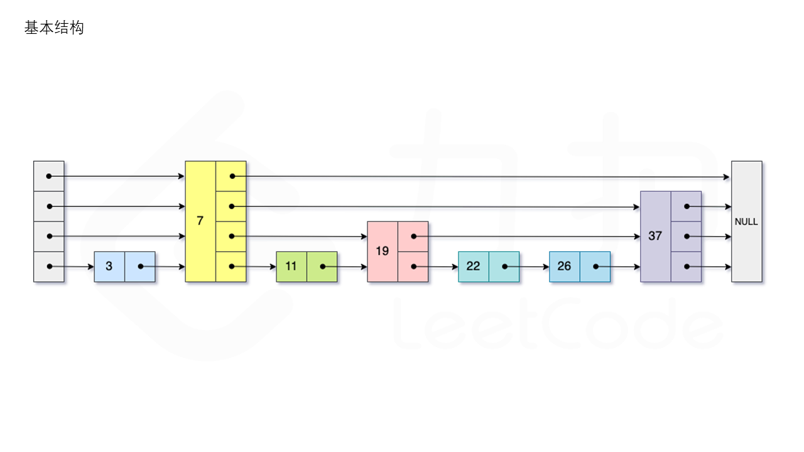
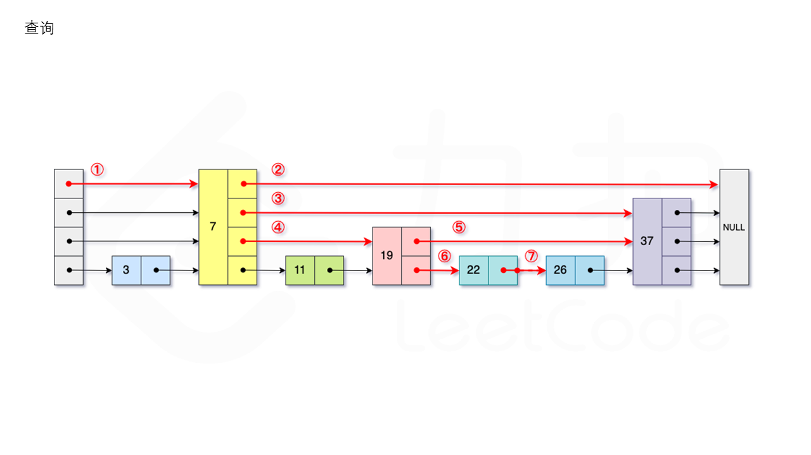
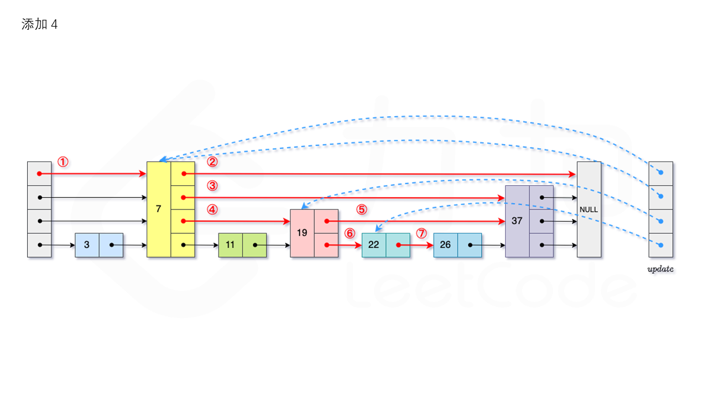
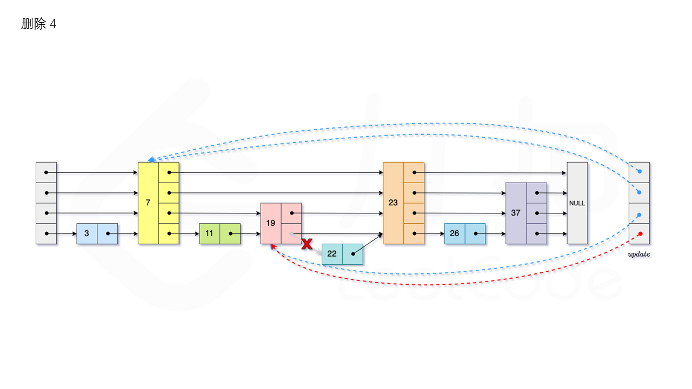

### 结构

跳表的期望空间复杂度为`O(n)`，跳表的查询，插入和删除操作的期望时间复杂度均为`O(logn)`。跳表实际为一种多层的有序链表，跳表的每一层都为一个有序链表，且满足每个位于第`i`层的节点有`p`的概率出现在第`i+1`层，其中`p`为常数。



### 查询

从跳表的当前的**最大**层数`level`层开始查找，在当前层水平地逐个比较直至当前节点的**下一个**节点**大于等于**目标节点，然后移动至下一层进行查找，重复这个过程直至到达第1层。此时，若第1层的下一个节点的值等于`target`，则返回`true`；反之，则返回`false`。如图所示：



### 添加

从跳表的当前的最大层数`level`层开始查找，在当前层水平地逐个比较直至当前节点的**下一个**节点**大于等于**目标节点，然后移动至下一层进行查找，重复这个过程直至到达第1层。设新加入的节点为`newNode`，我们需要计算出此次节点插入的层数`lv`，如果`level`小于`lv`，则同时需要更新`level`。我们用数组`update`保存每一层查找的**最后一个**节点，第`i`层最后的节点为`update[i]`。我们将`newNode`的后续节点指向`update[i]`的**下一个**节点，同时更新`update[i]`的后续节点为`newNode`。如图所示：



### 删除

首先我们需要查找当前元素是否存在跳表中。从跳表的当前的最大层数`level`层开始查找，在当前层水平地逐个比较直至当前节点的**下一个**节点**大于等于**目标节点，然后移动至下一层进行查找，重复这个过程直至到达第1层。如果第1层的**下一个**节点不等于`num`时，则表示当前元素不存在直接返回。我们用数组`update`保存每一层查找的**最后一个**节点，第`i`层最后的节点为`update[i]`。此时第`i`层的下一个节点的值为`num`，则我们需要将其从跳表中将其删除。由于第`i`层的以`p`的概率出现在第`i+1`层，因此我们应当从第1层开始往上进行更新，将`num`从`update[i]`的**下一跳**中删除，同时更新`update[i]`的后续节点，直到当前层的链表中没有出现`num`的节点为止。最后我们还需要更新跳表中当前的最大层数`level`。如图所示：



### 空间复杂度分析

每次添加节点时，节点出现在第`i`层的概率为$(1-p)×{p}^{i-1}$，跳表插入时的期望层数为:
$$
E(L)=\sum_{i=1}^{\infin}i×(1-p)×{p}^{i-1}=\frac{1}{1-p}
$$


如果节点的目标层数为`L`，则此时需要的空间为`O(L)`，因此总的空间复杂度为$O(n×E(L))=O(n×\frac{1}{1-p})=O(n)$。

### 时间复杂度分析

在含有`n`个节点的跳表中，当前最大层数`L(n)`包含的元素个数期望为$\frac{1}{p}$，根据跳表的定义可以知道第1层的每个元素出现在`L(n)`的概率为${p}^{L(n)-1}$，则此时我们可以推出如下：
$$
\frac{1}{p}=n{p}^{L(n)-1}
$$
根据以上结论可以知道在含有`n`个节点的跳表中，当前最大层数期望$L(n)={log}_{p}\frac{1}{n}$

令`C(i)`为在一个无限长度的跳表中向上爬`i`层的期望代价，最小代价即为往左上角爬，根据定义，则知道:
$$
\begin{gather}
C(0)=0 \\
C(i)=(1-p)(1+C(i))+p(1+C(i-1)) \\
C(i)=\frac{i}{p}
\end{gather}
$$
在含有`n`个元素的跳表中，从第1层爬到第`L(n)`层的期望步数存在上界$\frac{L(n)-1}{p}$，当达到第`L(n)`层后，我们需要向左走。我们已知`L(n)`层的节点总数的期望存在上界为$\frac{1}{p}$，所以平均查询时间复杂度为$\frac{L(n)-1}{p}+\frac{1}{p}=\frac{log_{\frac{1}{p}}n}{p}=O(log\ n)$

### 实现细节

每个跳表节点保存一个值以及下一列的**地址**

```java
class Skiplist {
    
    // 最大层数
    static final int MAX_LEVEL = 32;
    // 下一层留存概率
    static final double P = 0.5;
    // 哨兵节点
    private SkiplistNode head;
    // 当前最大层数
    private int level;
    // 用于插入时随机分配层数
    private Random random;

    public Skiplist() {
        this.head = new SkiplistNode(-1, MAX_LEVEL);
        this.level = 0;
        this.random = new Random();
    }
    
    public boolean search(int target) {
        SkiplistNode cur = this.head;
        // 从最高层开始向下查找
        for (int i = this.level - 1; i >= 0; i--) {
            // 在当前层从左往右查找不大于target的最大节点
            while (cur.forward[i] != null && cur.forward[i].val < target) {
                cur = cur.forward[i];
            }
        }
        // 下一节点
        cur = cur.forward[0];
        if (cur != null && cur.val == target) {
            return true;
        }
        return false;
    }
    
    public void add(int num) {
        // 保存每层需要更新下一节点的列地址
        SkiplistNode[] update = new SkiplistNode[MAX_LEVEL];
        Arrays.fill(update, this.head);
        SkiplistNode cur = this.head;
        for (int i = this.level - 1; i >= 0; i--) {
            while (cur.forward[i] != null && cur.forward[i].val < num) {
                cur = cur.forward[i];
            }
            update[i] = cur;
        }
        int lv = this.randomLevel();
        // 更新层数
        this.level = Math.max(this.level, lv);
        SkiplistNode newNode = new SkiplistNode(num, lv);
        // 更新列
        for (int i = 0; i < lv; i++) {
            newNode.forward[i] = update[i].forward[i];
            update[i].forward[i] = newNode;
        }
    }
    
    public boolean erase(int num) {
        SkiplistNode[] update = new SkiplistNode[MAX_LEVEL];
        SkiplistNode cur = this.head;
        for (int i = this.level - 1; i >= 0; i--) {
            while (cur.forward[i] != null && cur.forward[i].val < num) {
                cur = cur.forward[i];
            }
            update[i] = cur;
        }
        cur = cur.forward[0];
        // 不在跳表里
        if (cur == null || cur.val != num) {
            return false;
        }
        for (int i = 0; i < this.level; i++) {
            if (update[i].forward[i] != cur) {
                break;
            }
            update[i].forward[i] = cur.forward[i];
        }
        // 更新层数
        while (this.level > 1 && this.head.forward[this.level - 1] == null) {
            this.level--;
        }
        return true;
    }

    private int randomLevel() {
        int lv = 1;
        while (random.nextDouble() < P && lv < MAX_LEVEL) {
            lv++;
        }
        return lv;
    }
    
}

class SkiplistNode {
    
    // 节点值
    int val;
    // 下一列的地址
    SkiplistNode[] forward;

    public SkiplistNode(int val, int maxLevel) {
        this.val = val;
        this.forward = new SkiplistNode[maxLevel];
    }
    
}
```

